# Module 3 - Dashboards

## Overview

Other than the overall dashboard we discussed in Module 1, MDC provides several purpose built reports, which are presented as Workbooks. 

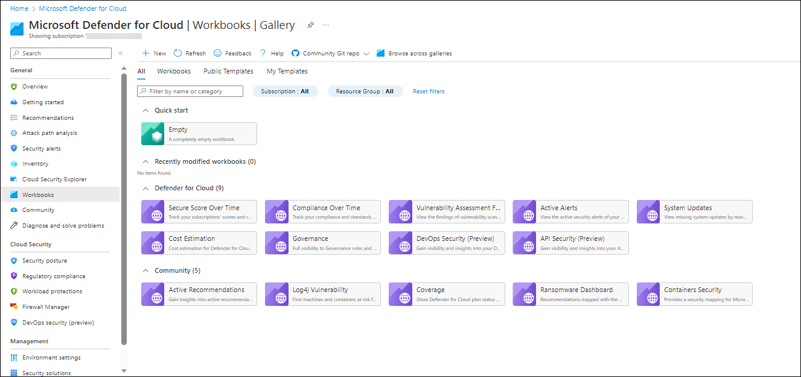

### Task 1: Ransomware Dashboard

1. From the available workbooks select ***Ransomware Dashboard*** under **Community**. The page shows the state of your current environment against various MITRE Tactics used by ransomwares.

   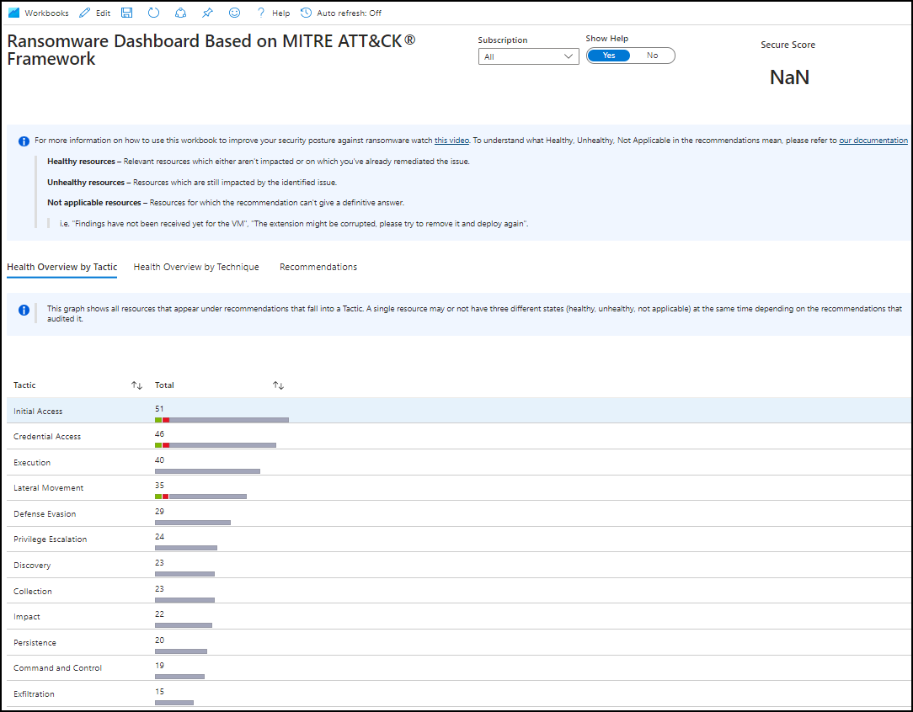

2. Select ***Recommendations*** to see technique specific recommendations.

   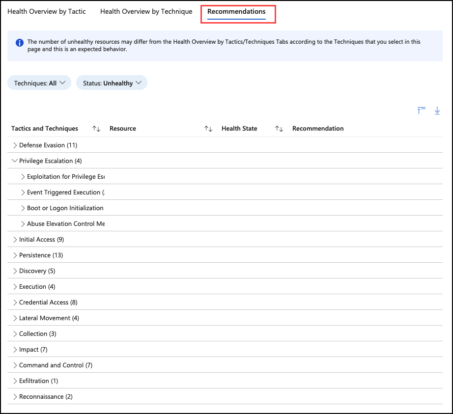

3. Select ***Discovery (1)*** and ***Container and Resource Discovery (2)***.

   

4. You can filter the Techniques. We will leave ***All*** selected.

   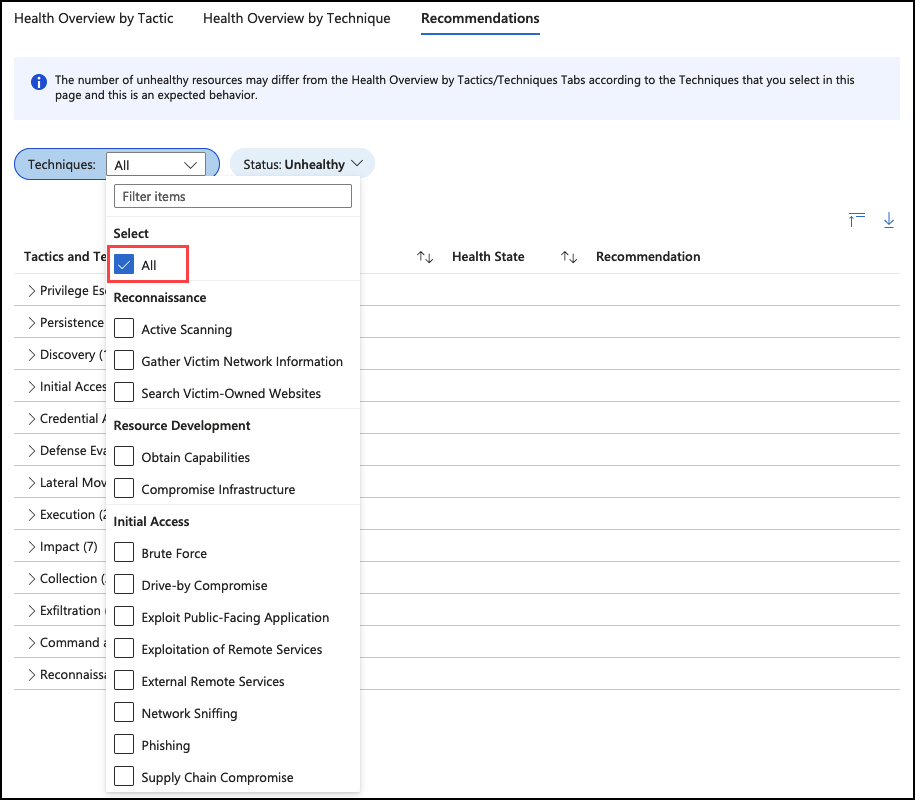

5. Select ***asclab-aks (1)*** under Resources and scroll to the right and click the ***Go to recommendation (2)*** link under URL.

    

6. You will be taken to the recommendation details that contains remediation steps and an option to Fix.

    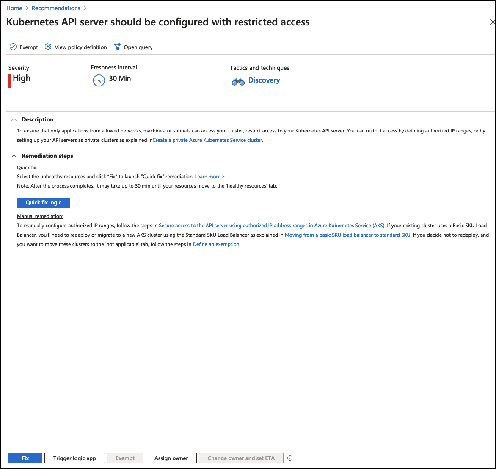

7. Close the Workbook by clicking the **X** at the top right corner of screen.

### Task 2: Identifying the coverage of your attack surface

1. Select the ***Coverage*** workbook under **Community**.

   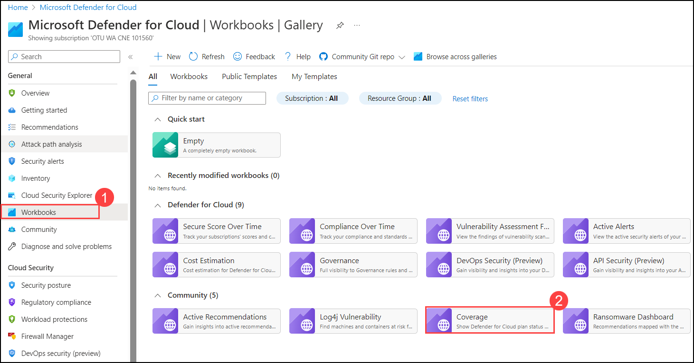

2. You can now see what Defender plans are enabled across different subscriptions.

3. To select the settings of any plan for a given subscription click the ***on*** or ***off*** corresponding to the plan.

   

5. Now you can change the plan settings.

    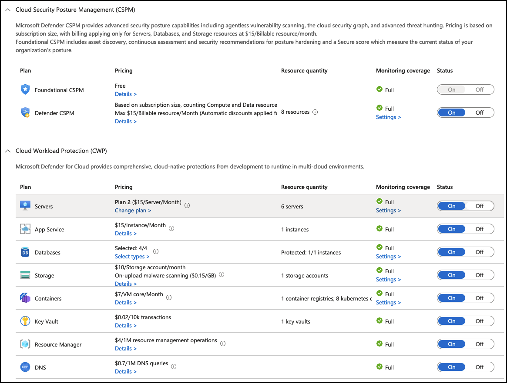

### Task 3: Deploying community workbooks

In addition to the workbooks available in the Azure Portal, you can also deploy several from the [MDC github](https://github.com/Azure/Microsoft-Defender-for-Cloud/tree/main/Workbooks)

1. From the ***Workbooks (1)*** blade select the ***Microsoft Defender for Cloud (2)*** under Community Git Repo.

   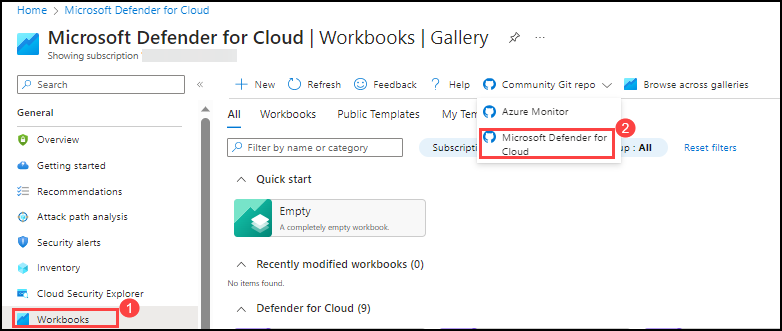

2. You will be taken to the MDC Github page. Scroll down to bottom to select **WellArchitected Framework Security**.

   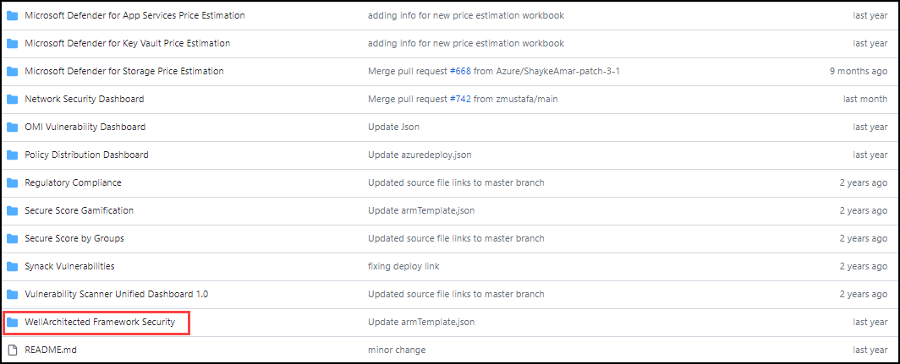

3. After selecting the workbook scroll down on the page until you see **Try it on the Azure Portal** and click the blue button *Deploy to Azure*.

   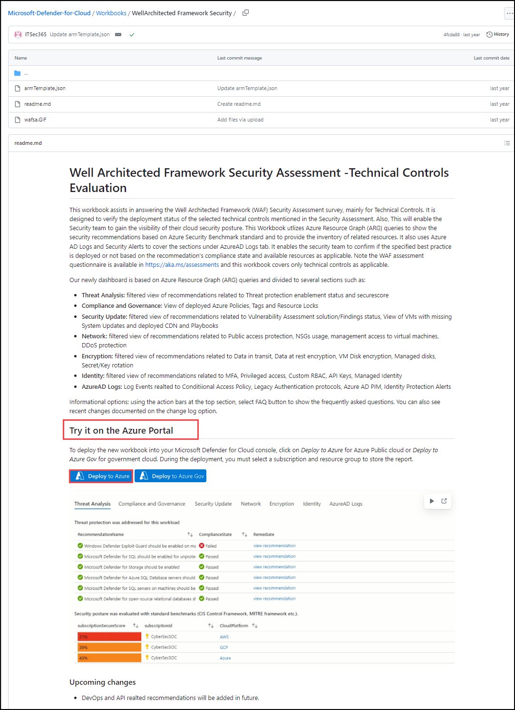

4. Choose the **subscription (1)** and **Resource Group (2)** from the dropdown and leave other settings unchanged. Press **Review + create (3)** button at bottom left corner. On subsequent screen press **create**.

   

5. Once deployment is completed, select **Go to resource** from the screen.

   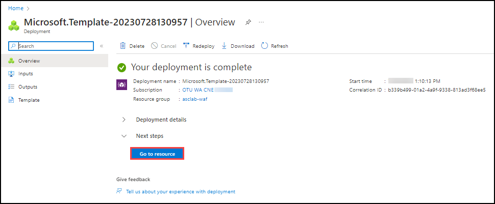

8. You will now get an option to open the workbook. Please go ahead and click on that button.

   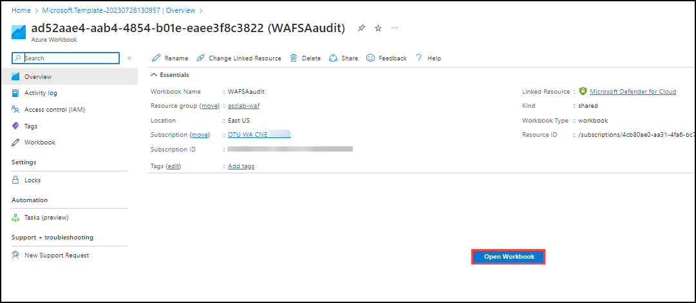

11. Now you will see the workbook, choose the Subscription Name as shown in fig below to see how that subscription scores against Well Architected Practices.

    

>**Note**: You can repeat this process to deploy other Workbooks from the community repo or any that you have created.
