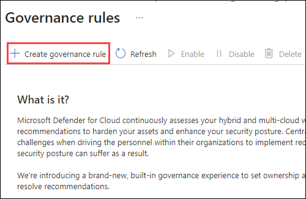

# Module 4 - Data Security Posture Management (DSPM)

### Task 1: Enabling Defender CSPM plan (Read Only)

In this exercise, you will learn how to enable Defender for CSPM, and leverage Defender for CSPM Capabilities

   >**Note:** To gain access to the capabilities provided by Defender CSPM, you'll need to <a href="https://learn.microsoft.com/en-us/azure/defender-for-cloud/enable-enhanced-security">enable the Defender Cloud Security Posture Management (CSPM) plan </a> on your subscription

1. In **Azure Portal**, search for **Microsoft Defender for Cloud (1)** and then click on it from the search results **(2)**. 

      

2. From **Defender for Cloud** menu, click on **Environment Settings (1)** page and select your subscription **(2)**.

      

3. In the **Defender plans** page, select **Defender CSPM** turn the status to **On (1)** and select **Settings & monitoring (2)**.

      

4. Turn **On (1)** the **Agentless scanning for machines (preview)** and click **Continue (2)**.

      

5. Click on **Save** to save the changes. 

   >**Note:** Agentless scanning for VMs provides vulnerability assessment and software inventory in 24 hours. Leave the setup and comeback after 24 hours.

      

### Task 2: Assign Governance Rule

1. From **Defender for Cloud** menu, click on **Environment Settings (1)** page and select your subscription **(2)**.

    

2. Under **Policy settings** Select **Governance Rules (1)** and click on **Enter the new experience (2)**.

    

3. Click on **+ Create governance rule**.

    

4. Enter **Rule name** as `asclab-rule` **(1)**, select **Scope** at subscription level **(2)** and **Priority** `100` **(3)**. Click **Next (4)**.

    
    
5. Under **conditions** provide the below details and click **Create (5)**
	
   - **By severity**: `High` **(1)**
   - **Owner**: `By email address` **(2)**
   - **Email address**: <inject key="AzureAdUserEmail"></inject> **(3)**
   - **Remediation timeframe**: `90 days` **(4)**

    

6. On the **Rule created succsessfuly** pop-up select the check box next to **Apply rule to the existing recommendations that are unassigned** and click on **Ok**.

    

7. Click on **Governance report** to view the status of tasks **Complete, Ontime and Unassign**.

    
    
    

