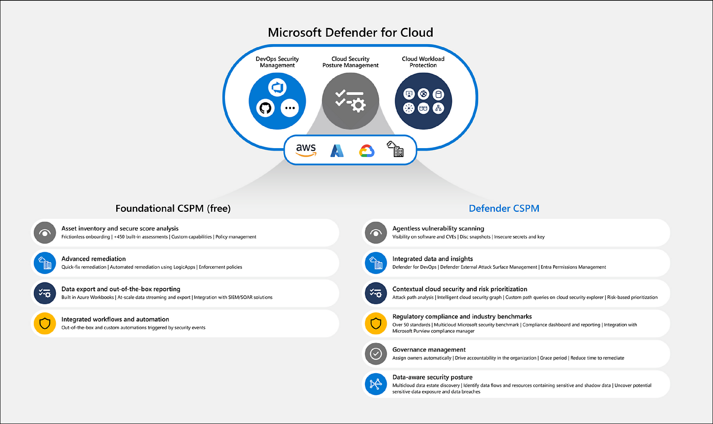
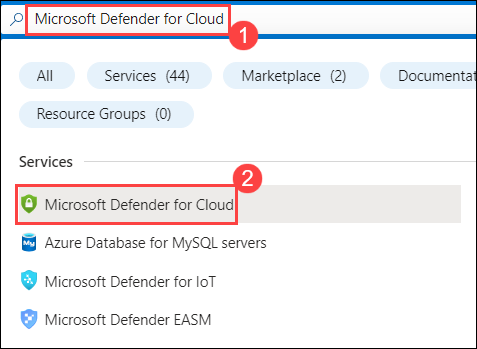

# Module 5 Data Security Posture Management (DSPM)

Defender CSPM extends existing free posture management capabilities to help security teams gain full visibility across their multicloud and hybrid environments, get integrated, contextual risk insights across their infrastructure, quickly identify their most critical risk with attack path analysis, and proactively remediate vulnerabilities and misconfigurations. And today, new integrated data-aware security posture capabilities empower teams to prevent data breaches with full visibility into the multicloud data estate and pressing risks to sensitive data.

### Task 1: Microsoft Defender Cloud Security Posture Management (Overview)

1. **Defender Cloud Security Posture Management**, will reduce the critical risks by:

     - **Monitor your multicloud security posture**: It gets continuous security assessments of your resources running across Microsoft Azure, AWS, Google Cloud Platform, and on-premises.
     
     - **Prioritize risks with contextual insights**: Identifies your most critical risks with insights from the security operations center (SOC), DevOps, APIs, Microsoft Defender External Attack Surface Management, Microsoft Entra Permissions Management, and Microsoft Purview, all in a single view.
     
     - **Get agent and agentless vulnerability scanning**: It gets continuous, real-time monitoring with agentless vulnerability scanning and gain deeper protection from built-in agents.
     
     - **Maintain compliance with multicloud benchmarks**: It follows best practices for multicloud security compliance with controls mapped to major regulatory industry benchmarks, such as the Center for Internet Security, the Payment Card Industry, and the National Institute for Standards and Technology, in a central dashboard. 

2. View the illustration below that depicts the main advantage offered by the Defender Cloud Security Posture Management scenario compared to the three parallel user scenarios for Defender for Cloud. From the icon representing Defender Cloud Security Posture Management, benefits such as visibility, contextual prioritization, and compliance are presented. This graph offers contextual insights for Defender for Cloud.

      

### Task 2: Enabling Defender CSPM plan (Read Only)

In this exercise, you will learn how to enable Defender for CSPM, and leverage Defender for CSPM Capabilities

   >**Note:** To gain access to the capabilities provided by Defender CSPM, you'll need to <a href="https://learn.microsoft.com/en-us/azure/defender-for-cloud/enable-enhanced-security">enable the Defender Cloud Security Posture Management (CSPM) plan </a> on your subscription

1. In **Azure Portal**, search for **Microsoft Defender for Cloud (1)** and then click on it from the search results **(2)**. 

      

2. From **Defender for Cloud** menu, click on **Environment Settings (1)** page and select your subscription **(2)**.

      

3. In the **Defender plans** page, select **Defender CSPM** turn the status to **On (1)** and select **Settings & monitoring (2)**.

      

4. Turn **On (1)** the **Agentless scanning for machines (preview)** and click **Continue (2)**.

      

5. Click on **Save** to save the changes. 

   >**Note:** Agentless scanning for VMs provides vulnerability assessment and software inventory in 24 hours. Leave the setup and comeback after 24 hours.

      
